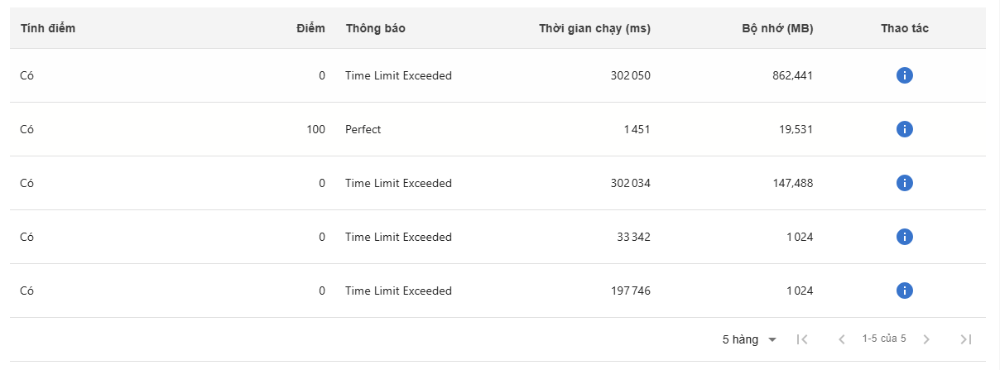
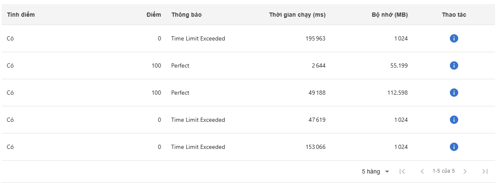
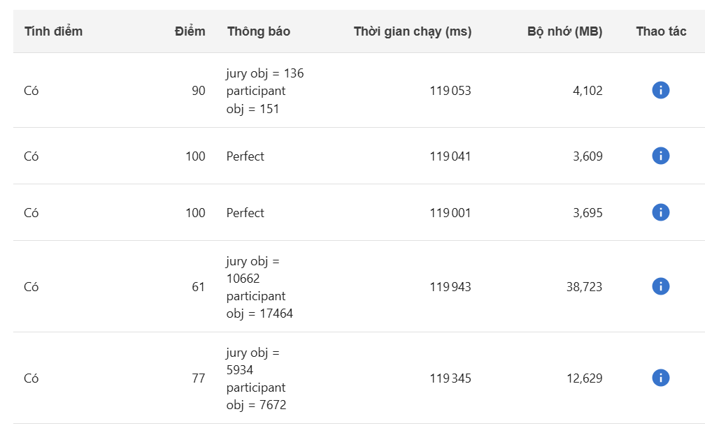
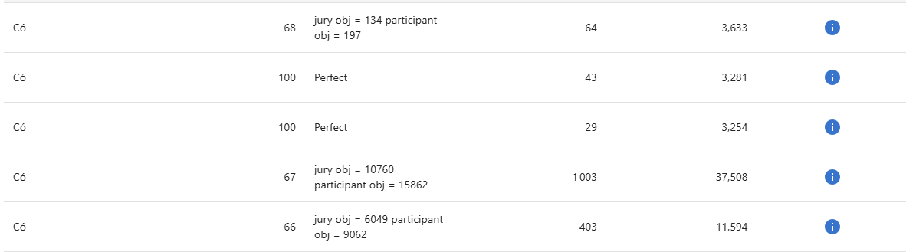

There are n passengers 1, 2, …, n. The passenger i want to travel from point i to point i + n (i = 1,2,…,n).
There is a bus located at point 0 and has k places for transporting the passengers
(it means at any time, there are at most k passengers on the bus).
You are given the distance matrix c in which c(i,j) is the traveling distance from point i to point j (i, j = 0,1,…, 2n).
Compute the shortest route for the bus, serving n passengers and coming back to point 0.
Input
Line 1 contains n and k (1≤n≤11,1≤k≤10)
 Line i+1 (i=1,2,…,2n+1) contains the (i−1)
th
 line of the matrix c (rows and columns are indexed from 0,1,2,..,2n).
Output
Unique line contains the length of the shortest route.

Thuật toán 1: SCIP (với biến times và biến đếm sô người trên xe)
Ưu điểm : dễ mô hình hóa
Nhược: vì nhiu biến nên không giải đưc bài toán quá lớn ( passenger <= 8 ) nhỏ hơn cả khi dùng vét cạn (passenger <=11)

Thuật toán 2: SCIP (lazyconstraints) -- chưa xong
Ưu điểm : passenger <= 20 trong 120s
Nhược: khó mô hình hóa

Thuật toán 3: CP
Ưu điểm : passenger <= 20 trong 120s
          mô dình hóa dễ hơn

Thuật toán 4: heuristics (HillClimbing)
Khởi tạo điểm bắt đầu từ một điểm xuất phát (là một giải pháp ban đầu)
Tìm kiếm lân cận xem liệu có giải pháp nào tốt hơn không.
Lựa chọn giải pháp tốt nhất
Lặp lại
Điều kiện dừng

Thuật toán 5: tham lam(greedy)
Ưu tiên đón hành khách gần nhất nếu còn chỗ.
Nếu đã đủ người hoặc không còn ai để đón → ưu tiên trả người đang trên xe, chọn người trả gần nhất.
Cập nhật trạng thái và lặp lại cho đến khi:
Đón và trả hết tất cả hành khách.

Ưu điểm: chạy nhanh (passenger >= 1000)
Nhược
